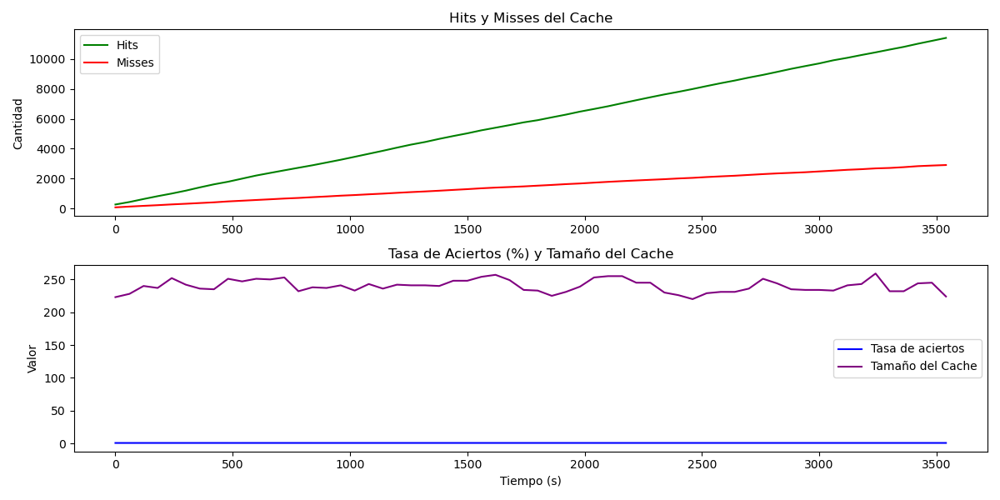

# ── ⋆⋅♡⋅⋆ ── Proyecto semestral Sistemas Distribuidos ── ⋆⋅♡⋅⋆ ──

Este proyecto corresponde a la entrega final del curso de Sistemas Distribuidos 2025-1. Su objetivo es procesar de manera distribuida los eventos de tráfico recolectados desde el mapa de Waze (https://www.waze.com/es-419/live-map/). Las alertas de trafico son extraidas, almacenadas, filtradas y finalmente pueden ser visualizadas con Kibana de Elasticsearch. Además contiene un módulo cache que funciona con simulación de tráfico generado artificialmente(modulo generator), esto con el objetivo de emular un sistema de cache real implementado con Redis.

Los módulos implementados son los siguientes:

## Scraper 
Captura las alertas desde el mapa de Waze (https://www.waze.com/es-419/live-map/) mediante scraper.py
## Almacenamiento
Este módulo se encarga de el almacenamiento de los datos previamente recuperados usando la base de datos no relacional MongoDB garantizando la persistencia de los datos a pesar de detener los servicios de Docker.
## Generator
Módulo encargado de generar tráfico simulado mediante generator.py usando técnicas de distribución de datos similares al comportamiento real de consultas. Emula la popularidad de las consultas mediante la función de distribución Zipf,propiedad estadística que establece que la frecuencia de un evento es inversamente proporcional a su rango en una lista ordenada por frecuencia. En otras palabras, esto genera que algunos datos sean más consultados que otros(más populares) emulando el comportamiento real de los usuarios.
## Cache
En el backend del caché se uso Redis. Este se encargó de almacenar las consultas más frecuentes previamente simuladas con el módulo generator. Se estableció 5MB como tañano de memoria de cache y se usó un TTL de 5 minutos y una política de remoción LFU.
Esto permitió una taza de aciertos sobre el 70 % y mantuvo en cache entre 200 a 250 registros durante el tiempo de análisis. Este análisis se realizó con un script de python para generar gráficos a partir de las métricas obtenidas durante una hora de ejecución(graficar_metricas.py). El gráfico obtenido fue el siguiente:



*En relación al resultado gráficos, cabe mencionar que la tasa de aciertos(linea azul) se ve como una línea recta debido a que este dato fluctúa entre 0 y 1, por lo que a gran escala se ve como si fuera una línea recta.

## Filtrado
Este módulo se encargó del filtrado de los datos provenientes de la base de datos(almacenamiento). Para ello se implementó el código filtrado.py que clasificó los registros de alertas por comunas a partir de sus coordenadas(latitud, longitud), también eliminó registros repetidos mediante los siguientes criterios:

1. Pertenecieron al mismo tipo de incidente
2. Ocurrieron en un rango temporal de 30 minutos de diferencia
3. Tuvieron una distancia espacial definida en el código como eps=0.0005
4. Ocurrieron en la misma comuna

Luego ordenó los datos en un archivo formato .csv y lo subió a Hadoop Distributed File System(HDFS).

## Procesamiento
Mediante el uso de Apache Pig se obtuvo el archivo .csv derivado del módulo filtrado y se usó para procesar algunas consultas en PigLatin (entrega 2)

## Visualización (entrega 3)
Este módulo implementó un script llamado visualización.py, el cual se encargó de extraer el archivo .csv de HDFS para indexarlo en ElasticSearch. Gracias a la herramienta de visualización de datos Kibana se pudo consultar los datos y generar gráficos.

# Persistencia de los datos
Se garantizó la persistencia de los datos mediante el uso de volúmenes en áreas críticas del sistema. 

# Pipelines

Para la ejecución del proyecto se implementaron 3 formas de proceder (pipelines).

1. Forma 1 (pipeline 1):
   Enfocado en la estracción de datos de waze y almacenamiento en base de datos MongoDB.
   Tambien ejecuta el modulo generator y cache, los cuales trabajan con los datos a medida que se van extrayendo en tiempo real.

   Modulos involucrados:
   - Scraper
   - Almacenamiento
   - Generator
   - Cache

2. Forma 2 (pipeline 2):
   Este pipeline filtra y procesa los datos luego de recolectar la cantidad deseadas en almacenamiento usando HDFS y Apache Pig. 

     Modulos involucrados:
   - Almacenamiento
   - Filtrado
   - Procesamiento

3. Forma 3 (pipeline 3):
   Pipeline enfocado en el uso del módulo visualización. Si ya se cuenta con el archivo .csv con los datos filtrados en HDFS, al ejecutar este pipeline se indexan los datos en ElasticSearch y quedan disponibles para interacción con Kibana.

   Modulos involucrados:
   - Almacenamiento
   - Visualización
     
5. Forma 4 (pipeline 4):
   Este pipeline es útil cuando ya se realizó todo el proceso anterior y los datos ya están cargados en Kibana. Su uso está principalmente orientado a la interacción con la interfaz visual de Kibana.
   

Para ejecutar un pipeline se debe usar el comando que sigue en la ubicación de la carpeta del proyecto.

```bash
chmod +x pipelines/pipeline1.py
./pipelines/pipeline1.py
    
```


# Otros comandos útiles

Para ver las métricas de cache gráficadas:

```bash
python graficar_metricas.py       
```
NOTA: Ejecutar mientras el cache está en funcionamiento (pipeline 1).


# Comentarios

Los archivos de gran tamaño y la configuración de hadoop no están presentes en el repositorio
